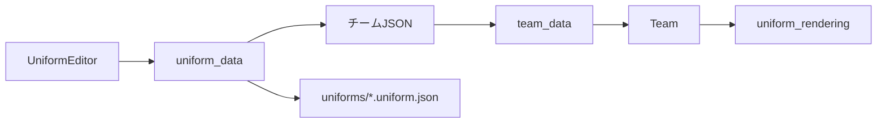

# ユニフォーム機能

## 概要

チームのユニフォームを5個の矩形パーツで構成し、チームエディタ内のドットエディタで編集する。模様はチームJSONとリーグ開始時のチームスナップショットに保存されるため、進行中のリーグは元チームを編集しても開始時のユニフォームを維持する。

| パーツ | キャンバス | 用途 |
|---|---:|---|
| 胸 | 6×6 | 選手の胴体 |
| 左腕 | 3×5 | 左腕 |
| 右腕 | 3×5 | 右腕 |
| 左脚 | 3×5 | 左脚 |
| 右脚 | 3×5 | 右脚 |

## 色セル

| 値 | 意味 |
|---|---|
| `P` | 試合時のチームメインカラー |
| `S` | メインカラーから生成したサブカラー |
| `#RRGGBB` | 固定色 |

`P`と`S`は描画時に解決する。同色対戦でアウェーチームの色が自動変更された場合も、模様を維持したまま新しい試合色へ置き換わる。ユニフォーム項目がない旧チームは、メインカラーの胸・腕とサブカラーの脚からなる標準デザインを使用する。

## JSON形式

`チーム情報.ユニフォーム`に次の形式で保存する。

```json
{
  "形式": "カドカルチョユニフォーム",
  "バージョン": 1,
  "パーツ": {
    "胸": [["P"]],
    "左腕": [["P"]],
    "右腕": [["P"]],
    "左脚": [["S"]],
    "右脚": [["S"]]
  }
}
```

実データでは各配列を上表の固定サイズへ正規化する。不足セル、不正な色、未知形式は標準セルで補う。単体の書出しファイルは`uniforms/<名前>.uniform.json`へ保存し、同じ形式を使う。

## 処理の分離



- `UniformEditor`は入力状態と画面操作だけを担当する。
- `uniform_data.py`は生成、正規化、検証、色解決、読込・書出しを担当する。
- `uniform_rendering.py`は投影済みの矩形・四肢へ模様を描画する。
- 全セルが同色のパーツは一回のポリゴン描画へ短絡し、旧チームの描画負荷を増やさない。
